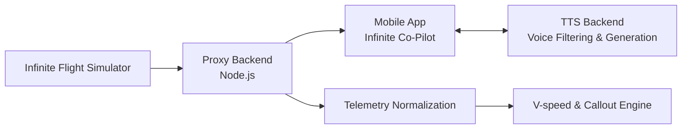

# Infinite Co-Pilot

> Your intelligent mobile flight assistant.

Infinite Co-Pilot is a dedicated mobile companion app for Infinite Flight. It provides cockpit-aware callouts, smart briefings, telemetry awareness, and crew-style assistance right from your iOS or Android device.

## Overview

The core objective of Infinite Co-Pilot is to deliver a highly polished, responsive, and realistic flight assistant on your mobile device. Rather than just dumping raw telemetry, it listens to the flight state, understands the current phase of flight, and responds with useful, pilot-facing voice callouts and cabin announcements.

*(Note: The repository contains some legacy web frontend code from our early prototyping phase, but all active development is strictly focused on the mobile application.)*

## Key Features

- **Mobile First Experience:** A clean, intuitive iOS/Android interface designed to be your second-screen companion.
- **Advanced Text-to-Speech:** Features specialized aviation radio voice filters and optimized male/female voice models for realistic communications.
- **Dynamic Cabin Announcements:** Automatically triggers safety briefings, turbulence warnings, and phase-of-flight specific announcements.
- **Smart Callouts:** Provides real-time V-speed calculations, gear-up reminders, and flap callouts based on live simulator telemetry.
- **Performance Mode:** A built-in background mode to conserve device battery and CPU on lower-end devices during long haul flights.

## Architecture & Project Structure

The ecosystem is split into three active components:

| Path | Purpose |
| ---- | ------- |
| `mobile-app/` | **Active:** The main iOS/Android mobile application (React Native/Expo). |
| `proxy-backend/` | **Active:** Node.js backend handling connection logic, telemetry polling, and WebSocket delivery. |
| `tts-backend/` | **Active:** Dedicated backend for processing and serving Text-to-Speech audio and voice filters. |



## How to Run

### 1. Proxy Backend
This handles the connection to Infinite Flight.
```bash
cd proxy-backend
npm install
npm start
```
Make sure to configure the Infinite Flight target IP in `proxy-backend/.env`.

### 2. TTS Backend
This handles the specialized voice generation.
```bash
cd tts-backend
npm install
npm start
```

### 3. Mobile App
```bash
cd mobile-app
npm install
npx expo start
```
For more specific instructions, please refer to the `mobile-app/` directory.

## Future Features

| Priority | Feature | Why It Matters |
| -------- | ------- | -------------- |
| High | Polished Mobile UI | Delivers the intended companion experience |
| High | Aviation Radio Filters | Adds extreme realism to TTS callouts |
| High | Phase-of-flight detection | Keeps announcements aligned with the actual flight |
| Medium | Route and map view | Adds operational awareness and continuity |
| Medium | Better aircraft profiles | Lets the app tailor behavior by type and airline style |

## Safety / Scope

This project is a companion tool, not an aviation authority system. Any operational logic, speech timing, or aircraft-specific behavior should be treated as assistive only and validated carefully before use in real flight environments.
