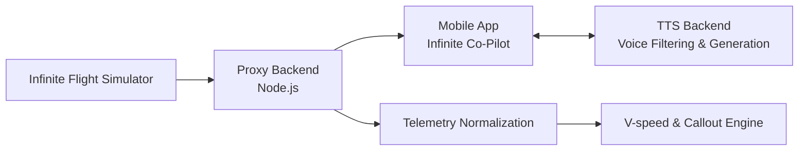

# Infinite Co-Pilot

> Your intelligent mobile flight assistant.

Infinite Co-Pilot (formerly FlightDeck) is a companion app for Infinite Flight, providing cockpit-aware callouts, smart briefings, telemetry awareness, and crew-style assistance.

## Overview

The project initially started with a web-based frontend. This web phase allowed us to experiment, test core telemetry features, and learn exactly what makes a great flight assistant. Having gathered those insights, we've now shifted our complete focus to our main objective: **a dedicated mobile app**. 

While the web frontend remains in the repository as a legacy component of our journey, all active development is now centered on the mobile experience, alongside our robust proxy and text-to-speech (TTS) backends.

## Current Focus

Our active development is entirely focused on the `mobile-app` and its supporting backends. We are currently working on:

- **Mobile First Experience:** A clean, intuitive iOS/Android interface.
- **Advanced Text-to-Speech:** Including specialized aviation radio voice filters, hybrid TTS implementation strategies, and optimized male/female voice models.
- **Dynamic Cabin Announcements:** Safety briefings, turbulence warnings, and phase-of-flight specific announcements.
- **Smart Callouts:** Automatic V-speed calculations, gear-up reminders, and flap callouts based on real-time telemetry.

## Project Structure

| Path | Purpose |
| ---- | ------- |
| `mobile-app/` | **Active:** The main mobile application source code. |
| `proxy-backend/` | **Active:** Node.js backend that handles connection logic, telemetry polling, and WebSocket delivery. |
| `tts-backend/` | **Active:** Dedicated backend for processing and serving Text-to-Speech audio and voice filters. |
| `web-frontend/` | **Legacy:** The original web-based UI used for early testing and experimentation. No longer actively updated. |
| `airport-codes.csv` | Global Airport Database (ICAO) used for route tracking and telemetry. |

## Architecture



## How to Run

### 1. Proxy Backend
This handles the connection to Infinite Flight.
```bash
cd proxy-backend
npm install
npm start
```
Make sure to configure the Infinite Flight target IP in `proxy-backend/.env`.

### 2. TTS Backend
This handles the specialized voice generation.
```bash
cd tts-backend
npm install
npm start
```

### 3. Mobile App
For running the mobile app, please refer to the specific instructions within the `mobile-app/` directory.

## Future Features

| Priority | Feature | Why It Matters |
| -------- | ------- | -------------- |
| High | Polished Mobile UI | Delivers the intended companion experience |
| High | Aviation Radio Filters | Adds extreme realism to TTS callouts |
| High | Phase-of-flight detection | Keeps announcements aligned with the actual flight |
| Medium | Route and map view | Adds operational awareness and continuity |
| Medium | Better aircraft profiles | Lets the app tailor behavior by type and airline style |

## Safety / Scope

This project is a companion tool, not an aviation authority system. Any operational logic, speech timing, or aircraft-specific behavior should be treated as assistive only and validated carefully before use in real flight environments.
