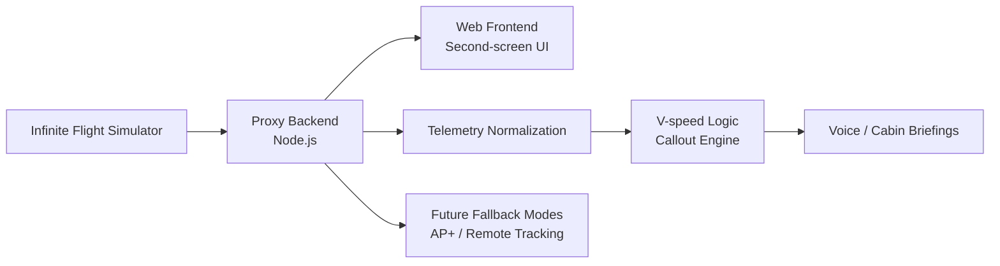
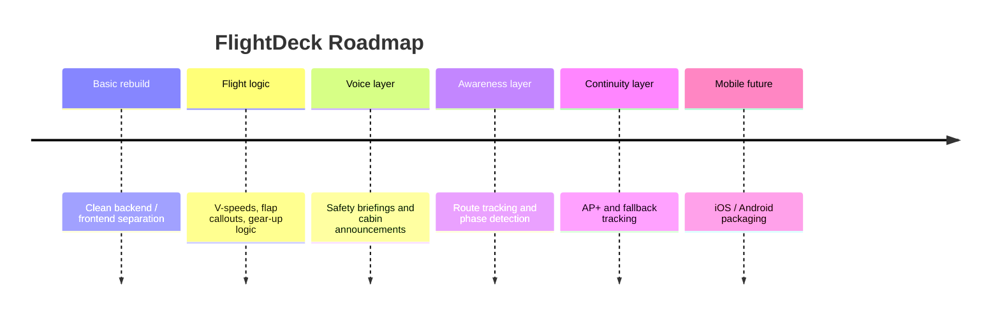

# FlightDeck

> Your intelligent second seat.

FlightDeck is a second-screen flight assistant built for Infinite Flight, providing cockpit-aware callouts, smart briefings, telemetry awareness, and crew-style assistance.

## Overview

FlightDeck is a work-in-progress companion app for Infinite Flight. The goal is not to be a raw telemetry dump, but a practical assistant layer that listens to the flight state, understands the phase of flight, and responds with useful pilot-facing callouts.

The project is being rebuilt in a simpler, cleaner form:

- one lightweight Node.js proxy backend
- one static web frontend (React/Vite)
- a source-aware telemetry model that can evolve toward live data plus future fallback modes
- voice-first features such as safety briefings, V-speed callouts, and cabin announcements

## What It Is Trying To Be

| Area                  | Goal                                                                   |
| --------------------- | ---------------------------------------------------------------------- |
| Flight assistance     | Speak meaningful callouts at the right moment, not constant noise      |
| Bilingual experience  | Support airline-style briefings in English plus a second language      |
| Operational awareness | Show the pilot what matters during takeoff, climb, cruise, and landing |
| Second-screen design  | Stay beside the simulator as a companion, not a replacement            |
| Future mobile app     | Move toward a cleaner iOS / Android experience over time               |

## Current Focus

The rebuild starts basic and intentional. The initial scope is centered on:

- bilingual airline safety briefings
- automatic V-speed calculation
- V1 / Vr / V2 callouts from the FlightDeck Assistant
- flap-related callouts such as flap-up reminders
- gear-up callouts after positive rate
- arrival and landing callouts later in the roadmap

## Feature Snapshot

| Status               | Feature                    | Notes                                                                    |
| -------------------- | -------------------------- | ------------------------------------------------------------------------ |
| Planned / rebuilding | Bilingual safety briefings | English plus airline-specific language support                           |
| Planned / rebuilding | Smart V-speed calculator   | Derived from aircraft type and takeoff weight                            |
| Planned / rebuilding | Takeoff callouts           | V1, Rotate, Positive Rate, Gear Up                                       |
| Planned / rebuilding | Cabin announcements        | Welcome, safety briefing, turbulence, arrival                            |
| Planned / rebuilding | Telemetry-aware UI         | Reacts to available simulator data instead of assuming everything exists |
| Planned              | Map and route tracking     | Flight path continuity and position awareness                            |
| Planned              | AP+ continuity mode        | Reduced but useful tracking when local live data is no longer available  |
| Planned              | Mobile packaging           | Future iOS and Android direction                                         |

## Architecture



The proxy backend is the core of the system. It handles connection logic, field polling, telemetry normalization, and websocket delivery to the frontend. The frontend stays focused on presentation and crew-style assistance.

## Tech Stack

| Layer               | Tools                                                |
| ------------------- | ---------------------------------------------------- |
| Backend             | Node.js, Express, Socket.IO, ifc2, Axios, dotenv     |
| Frontend            | React, Vite, Tailwind CSS v4, Socket.IO client       |
| Transport           | WebSocket-style realtime updates                     |
| Future UI direction | TypeScript, mapping support, mobile packaging        |

## Project Structure

| Path                                                         | Purpose                          |
| ------------------------------------------------------------ | -------------------------------- |
| [proxy-backend/server.js](proxy-backend/server.js)           | Main backend proxy entrypoint    |
| [proxy-backend/ifc-handler.js](proxy-backend/ifc-handler.js) | IFC2 helper wrapper              |
| [proxy-backend/package.json](proxy-backend/package.json)     | Backend scripts and dependencies |
| [proxy-backend/README.md](proxy-backend/README.md)           | Backend-specific notes           |
| [web-frontend/index.html](web-frontend/index.html)           | Current frontend entrypoint      |
| [README.md](README.md)                                       | This project overview            |

## How To Run

### 1. Install dependencies

Run the install command inside the backend folder:

```bash
cd proxy-backend
npm install
```

### 2. Configure the simulator target

Set the Infinite Flight target IP in [proxy-backend/.env](proxy-backend/.env):

```env
IFC_TARGET_IP=192.168.1.10
```

If you are using auto-discovery, make sure the simulator device is on the same network and discoverable by the proxy.

### 3. Start the backend

```bash
cd proxy-backend
npm start
```

The backend will typically run on:

```text
http://localhost:3000
```

### 4. Open the frontend

The frontend is a Vite + React application.

```bash
cd web-frontend
npm install
npm run dev
```

## Development Notes

- The app is being rebuilt with a smaller, cleaner scope.
- The backend should stay source-aware and avoid assuming every telemetry key is always present.
- Callouts should be phase-based and pilot-useful, not constant or noisy.
- Language support should feel like an airline assistant, not a literal translator.

## Future Features

| Priority | Feature                              | Why It Matters                                             |
| -------- | ------------------------------------ | ---------------------------------------------------------- |
| High     | Smart cabin briefings                | Gives the app its assistant identity                       |
| High     | More aircraft-specific V-speed logic | Makes the callouts feel believable across aircraft types   |
| High     | Flap and gear callouts               | Core takeoff flow automation                               |
| High     | Phase-of-flight detection            | Keeps announcements aligned with the actual flight         |
| Medium   | Route and map view                   | Adds operational awareness and continuity                  |
| Medium   | AP+ fallback mode                    | Keeps the app useful when direct live telemetry is reduced |
| Medium   | Better aircraft profiles             | Lets the app tailor behavior by type and airline style     |
| Medium   | Voice tuning                         | Improves timing, tone, and realism                         |
| Lower    | Mobile packaging                     | Long-term iOS / Android direction                          |

## Roadmap Infographic



## Safety / Scope

This project is a companion tool, not an aviation authority system. Any operational logic, speech timing, or aircraft-specific behavior should be treated as assistive only and validated carefully before use in real flight environments.

## Status

FlightDeck is currently a work in progress. The app is being simplified first, with the most important early goal being a clean base for bilingual briefings and automated crew callouts.
